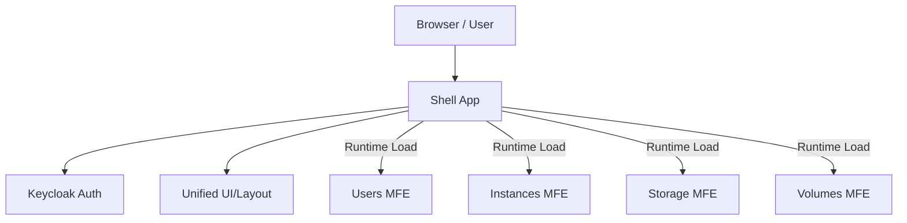

# 🌐 Enterprise Angular Micro-Frontend Platform

> **A future-safe, high-performance Micro-Frontend architecture built with Angular 21, Web Components, and Zoneless Change Detection.**

This repository contains a production-grade blueprint for building large-scale Angular applications using the **Web Components (Angular Elements)** pattern. It allows multiple teams to build, test, and deploy features independently without the version-locking pitfalls of traditional Module Federation or Monorepos.

---

## 🏗️ Architecture Overview

The platform is divided into a **Shell Container** and several **Micro-Apps**.

- **Shell App**: The "Orchestrator." Handles Authentication (Keycloak), Global Navigation, Routing, and Runtime Loading.
- **Users App**: Manages identity and permissions.
- **Instances App**: Core infrastructure management.
- **Storage App**: Data volume and object storage tools.
- **Volumes App**: Block storage management.

### Platform Blueprint


---

## 🚀 Key Features

| Feature | Description |
| :--- | :--- |
| **Independent Deployment** | Each micro-app can be deployed to production individually without rebuilding the Shell. |
| **Zoneless Performance** | Uses `ProjectZonelessChangeDetection` for superior performance and smaller bundles (no Zone.js). |
| **Runtime Configuration**| MFEs are loaded via a dynamic `mfe.config.json` file. Change a URL in JSON to swap versions instantly. |
| **Enterprise Auth** | Built-in Keycloak integration with Role-Based Access Control (RBAC). |
| **Unified UX** | A cohesive Dashboard, Sidebar, and Header management system controlled by the Shell. |
| **Cloud Native** | Full Dockerization and Kubernetes (Deployment/Service/Blue-Green) manifests included. |

---

## 🛠️ Tech Stack

- **Core**: Angular 21 (Signals, Standalone, Zoneless)
- **MFE Pattern**: Angular Elements (Custom Elements / Web Components)
- **Auth**: Keycloak JS / Keycloak Angular
- **Infrastructure**: Docker, Nginx, Kubernetes
- **Build**: Vite / Angular Application Builder

---

## 🚦 Getting Started (Local Development)

### Prerequisites
- Node.js v20+
- Angular CLI installed globally (`npm install -g @angular/cli`)

### 1. Installation
Clone the repository and install dependencies for all apps:
```bash
# This is a multi-repo style setup in a single folder for demo.
# Real world: Each of these would be a separate git repo.
cd shell && npm install --legacy-peer-deps
cd ../users && npm install
cd ../instances && npm install
cd ../storage && npm install
cd ../volumes && npm install
```

### 2. Run All Apps Concurrently
Use the provided automation script to spin up the Shell and all 4 Micro-apps in dev mode:
```bash
chmod +x run-local.sh
./run-local.sh
```
- **Shell**: [http://localhost:4200](http://localhost:4200)
- **Users**: [http://localhost:4201](http://localhost:4201)
- **Instances**: [http://localhost:4202](http://localhost:4202) ...and so on.

---

## 📦 Deployment & DevOps

### Build Everything
To generate production bundles for all apps:
```bash
chmod +x build-all.sh
./build-all.sh
```

### Containerization
Each app contains its own `Dockerfile`. 
```bash
docker build -t shell-app:latest ./shell
```

### Kubernetes (Independent Rollouts)
The `k8s/` folder in each app directory contains standard manifests and a `blue_green.yaml` example to demonstrate zero-downtime deployments.

---

## 📂 Project Structure
```text
.
├── shell/            # The Orchestrator (Port 4200)
├── users/            # Users MFE (Port 4201)
├── instances/        # Instances MFE (Port 4202)
├── storage/          # Storage MFE (Port 4203)
├── volumes/          # Volumes MFE (Port 4204)
├── build-all.sh      # Master build automation
└── run-local.sh      # Parallel development runner
```

---

## 📝 Implementation Notes

1. **Loader Logic**: The Shell uses the `MfeLoaderService` to inject `<script type="module">` tags at runtime based on the route.
2. **Custom Elements**: Each Micro-app registers itself as a Web Component (e.g., `customElements.define('users-app', el)`) in its `main.ts`.
3. **Communication**: For cross-MFE communication, use the DOM's `CustomEvent` API or a shared state management library if necessary (though decoupling is preferred).

---
*Built with ❤️ by the Enterprise Platform Team - Angular 20+ Ready.*
