# Sequence Diagrams - Angular Micro-Frontend Platform

This document contains Mermaid sequence diagrams illustrating the key flows in the application.

---

## 1. Application Startup Flow

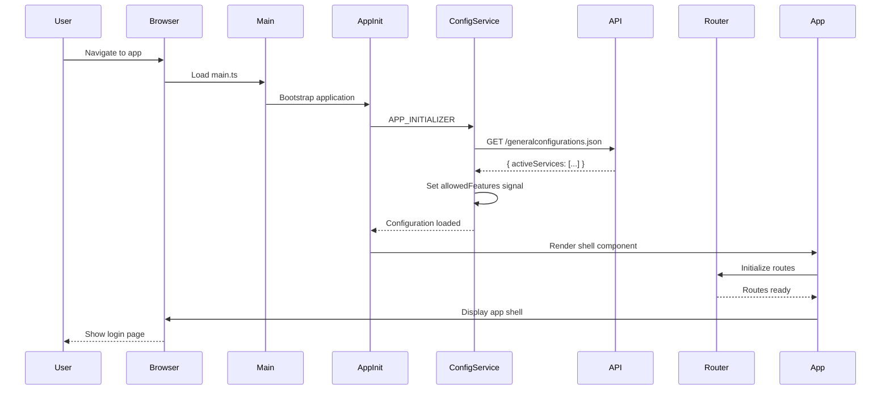

---

## 2. User Login Flow

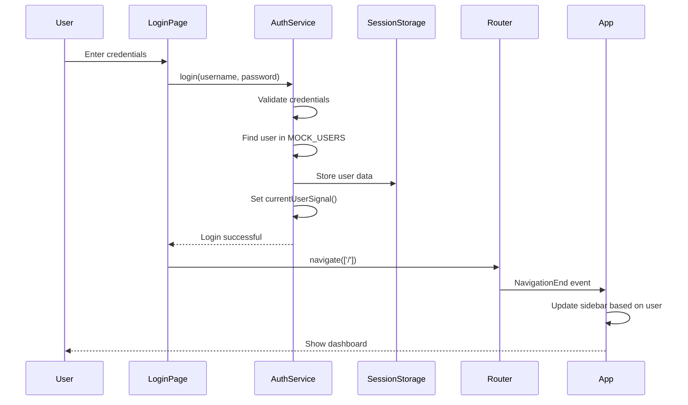

---

## 3. Module Loading with @defer Flow

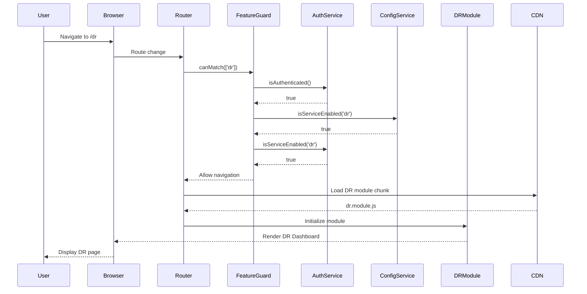

---

## 4. Component Lazy Loading with @defer (Permission-Based)

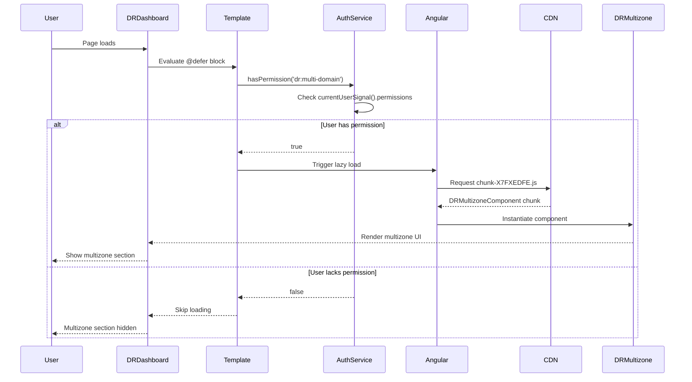

---

## 5. Viewport-Based Lazy Loading Flow

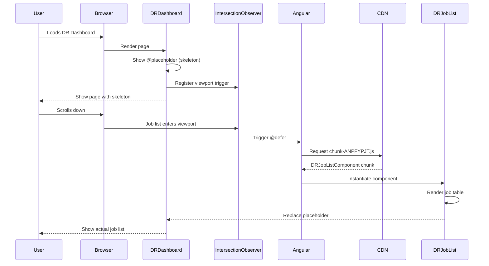

---

## 6. Permission Check Flow (Directive)

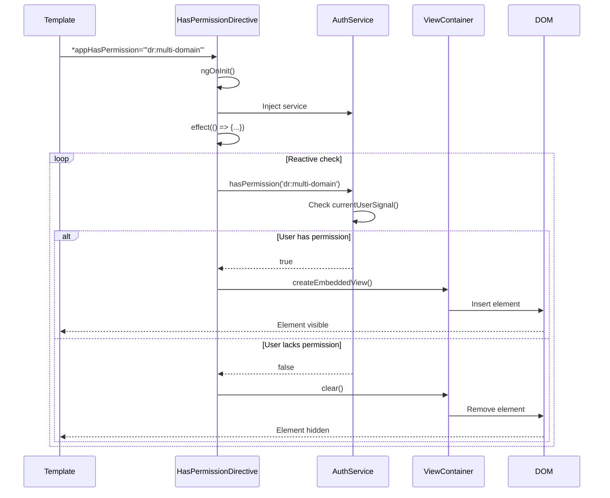

---

## 7. Dynamic Sidebar Update Flow

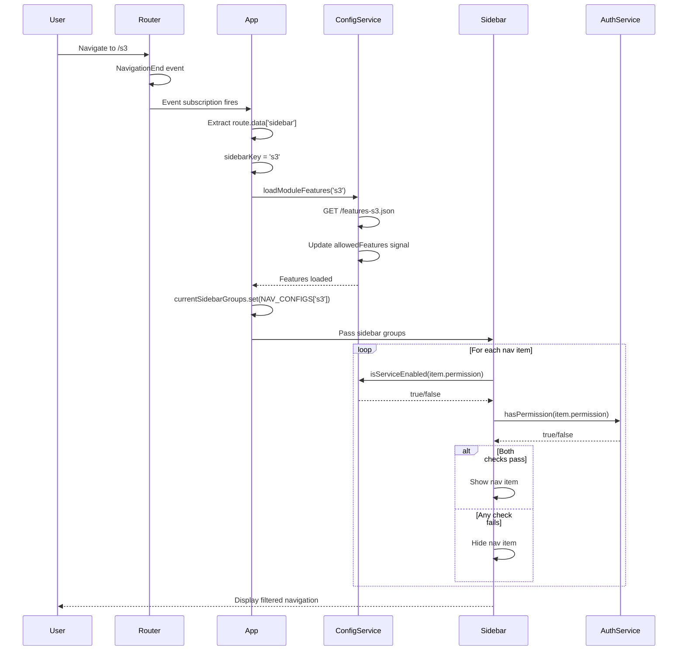

---

## 8. Feature Guard Route Protection Flow

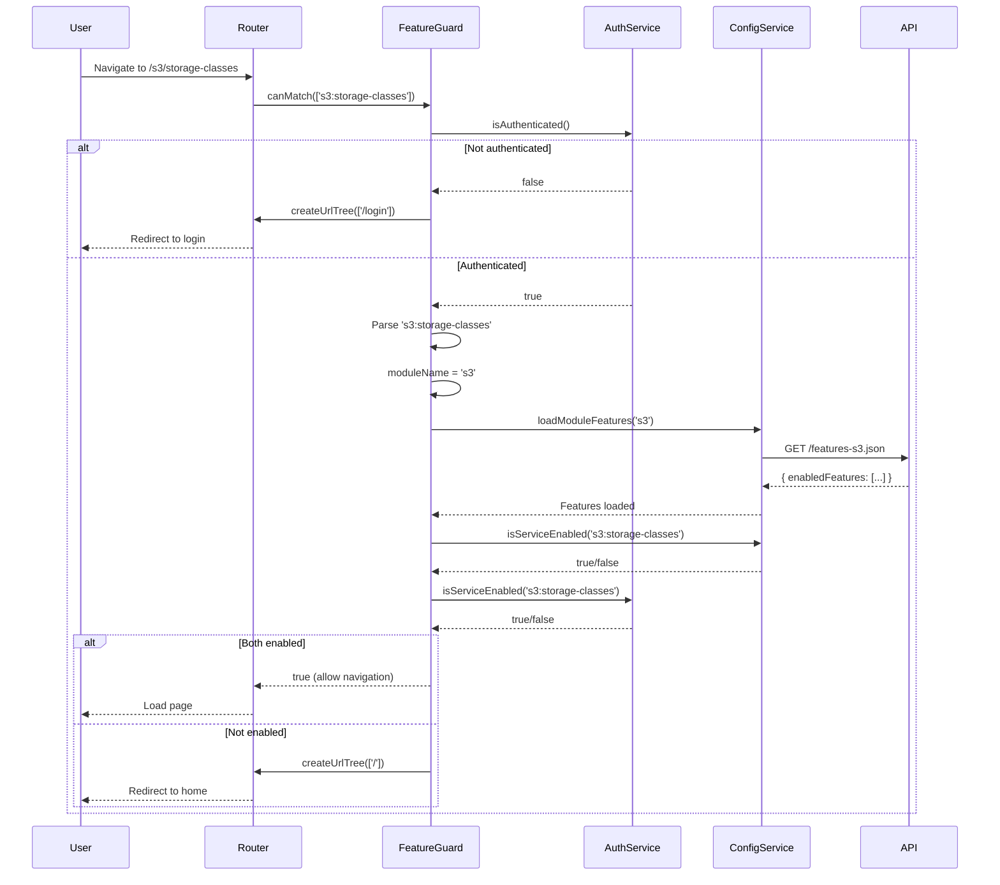

---

## 9. @defer Loading States Flow

```mermaid
sequenceDiagram
    participant User
    participant Template
    participant Angular
    participant CDN
    participant Component

    User->>Template: Page loads
    Template->>Template: Evaluate @defer condition
    
    alt Condition is true
        Template->>Angular: Show @loading block
        Angular-->>User: Display skeleton UI
        Note over Angular: minimum 1s; after 100ms
        
        Angular->>CDN: Request component chunk
        
        alt Successful load
            CDN-->>Angular: Component code
            Angular->>Component: Instantiate
            Component-->>Angular: Rendered
            Angular->>Template: Replace @loading with component
            Template-->>User: Show actual component
        else Load fails
            CDN-->>Angular: Error
            Angular->>Template: Show @error block
            Template-->>User: Display error message
        end
    else Condition is false
        Template->>Template: Show @placeholder block
        Template-->>User: Display placeholder UI
        Note over Template: minimum 500ms
    end
```

---

## 10. Configuration Loading Flow

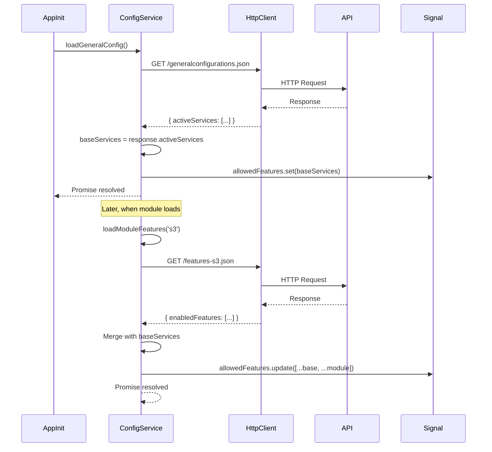

---

## 11. Signal-Based Reactivity Flow

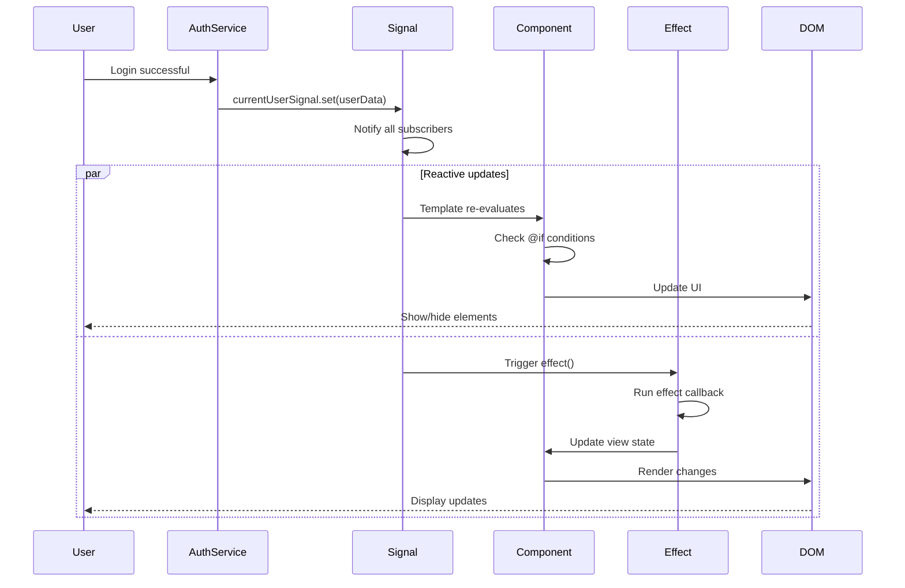

---

## 12. Complete User Journey Flow

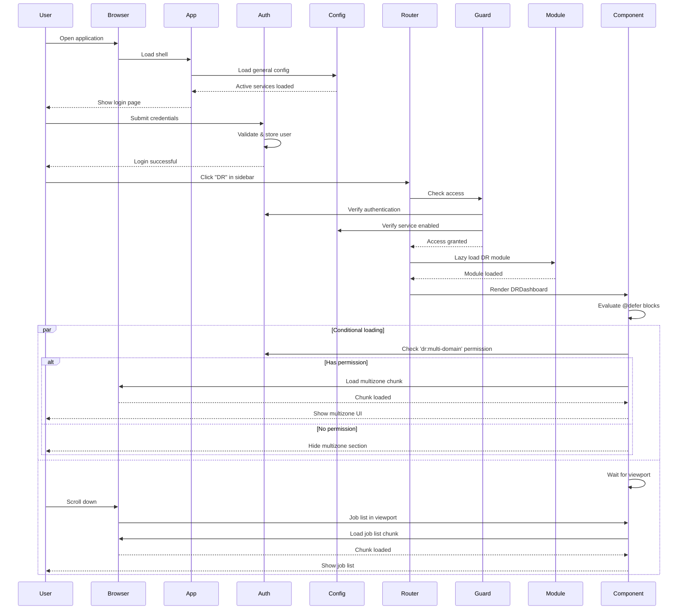

---

## Usage Instructions

### Viewing Diagrams

1. **GitHub/GitLab**: These platforms render Mermaid diagrams automatically.
2. **VS Code**: Install the "Markdown Preview Mermaid Support" extension.
3. **Online**: Use [Mermaid Live Editor](https://mermaid.live/).
4. **Documentation Sites**: Most support Mermaid (Docusaurus, VitePress, etc.).

### Customizing Diagrams

You can modify these diagrams by:
- Adding new participants
- Changing flow logic
- Adding notes with `Note over Participant: Text`
- Using `alt/else/end` for conditional flows
- Using `par/and/end` for parallel flows
- Using `loop/end` for iterations

---

**Last Updated:** December 24, 2025  
**Version:** 1.0.0
